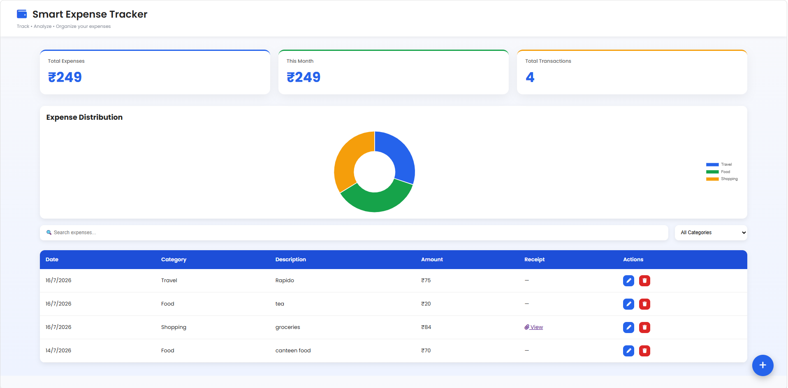
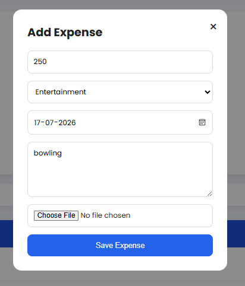
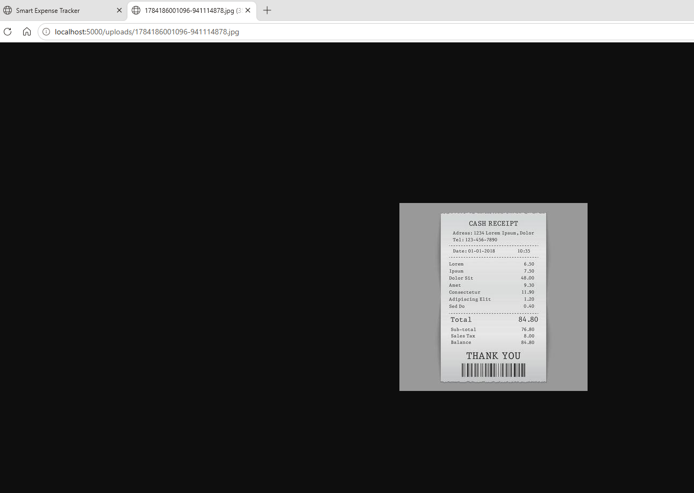
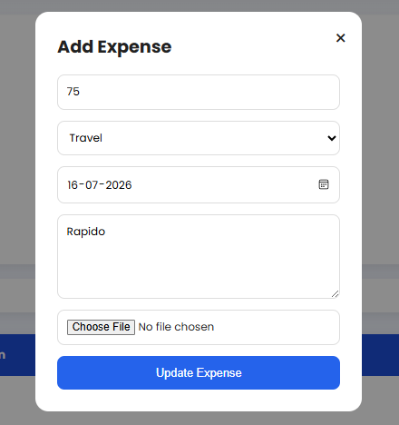
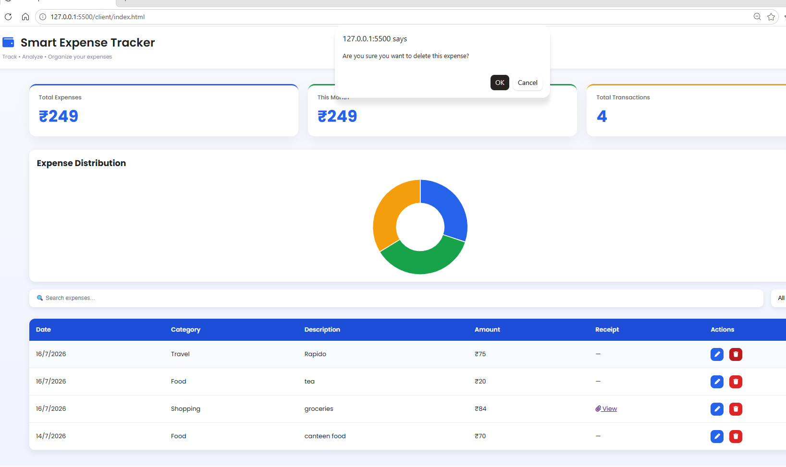

# Smart Expense Tracker

Smart Expense Tracker is a full-stack web application built to simplify personal expense management. It allows users to record, organize, search, and analyze their daily expenses while providing visual insights through an interactive dashboard. Users can also upload receipt images with each expense, making it easier to maintain a digital record of transactions.

---

## Features

- Add, edit, and delete expenses
- Search expenses by description or category
- Filter expenses by category
- Dashboard displaying expense summary
- Interactive pie chart for expense analysis
- Upload and view receipt images
- Clean and intuitive user interface

---
## Application Preview

### Dashboard



---

### Add Expense



---

### Search & Filter


---

### Receipt Upload



---

### Edit Expense



---

### Delete Expense



---

## Tech Stack

### Frontend
- HTML
- CSS
- JavaScript

### Backend
- Node.js
- Express.js

### Database
- MongoDB
- Mongoose

### Libraries & Tools
- Multer (Receipt Uploads)
- Chart.js (Data Visualization)

---

## Project Structure

```
Smart-Expense-Tracker/
│
├── client/
├── server/
├── docs/
│   ├── screenshots/
│   └── sample-receipts/
├── python/
├── .gitignore
└── README.md
```

---

## Why I Built This

This project was developed during my internship to strengthen my understanding of full-stack web development. It focuses on building a practical expense management system using CRUD operations, REST APIs, MongoDB integration, file uploads, and data visualization.

---

## Future Improvements

- OCR-based receipt scanning
- Monthly budget planning
- User authentication
- Export expenses to PDF or Excel

---

## Author

**Rhea Nair**
